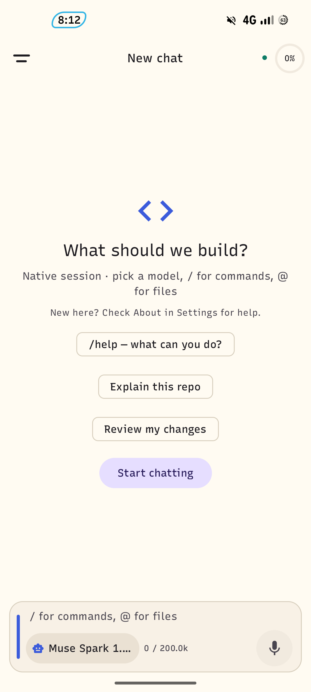
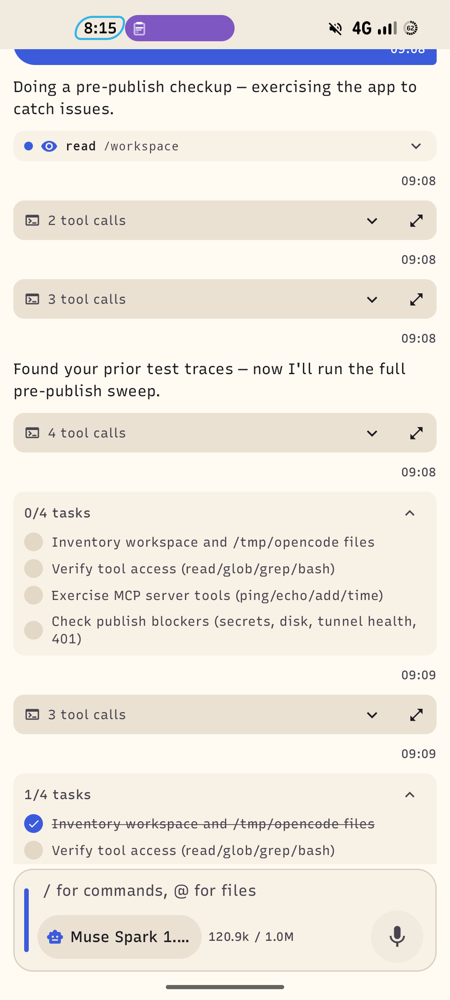
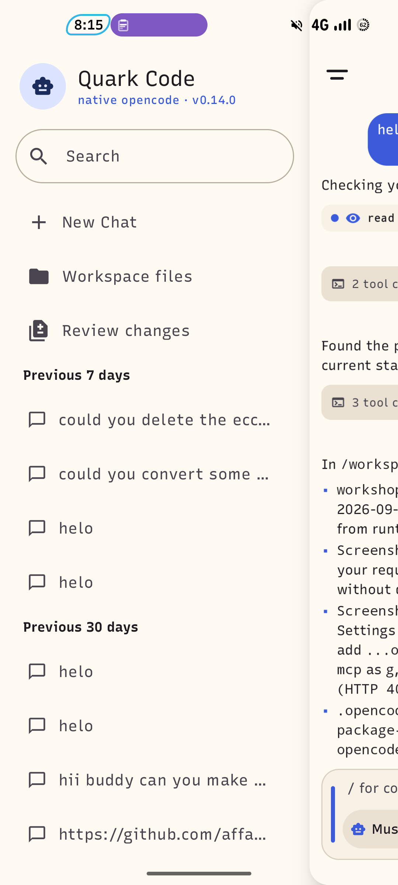
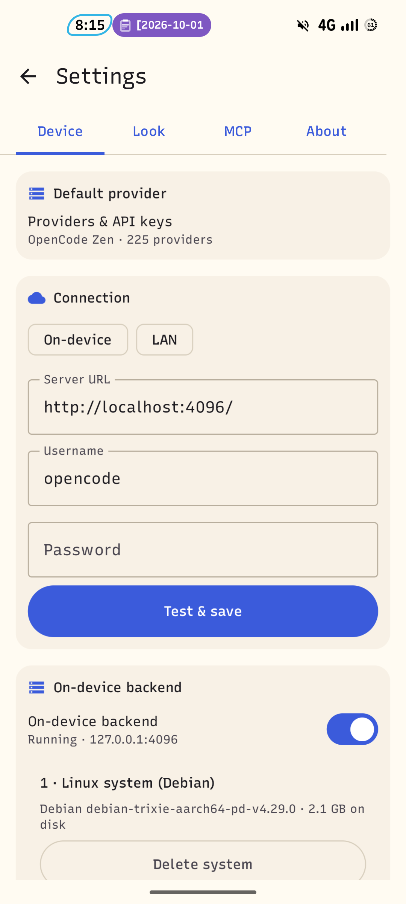
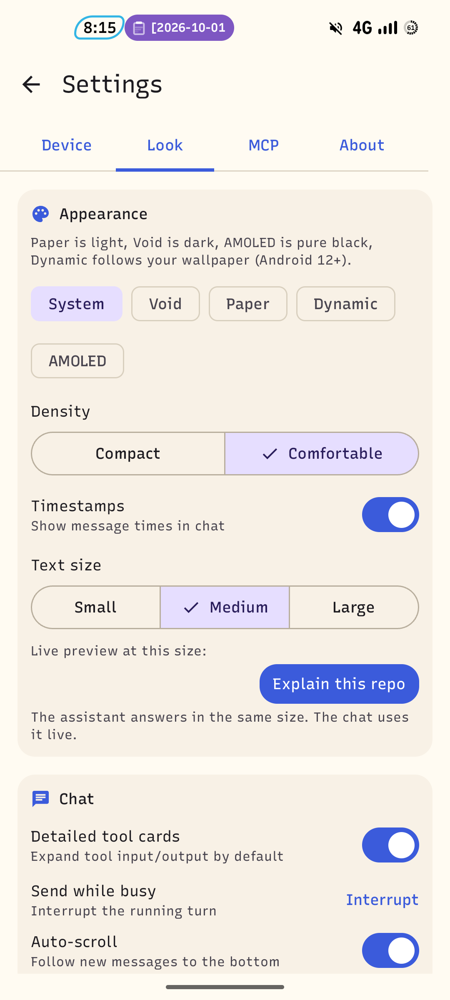
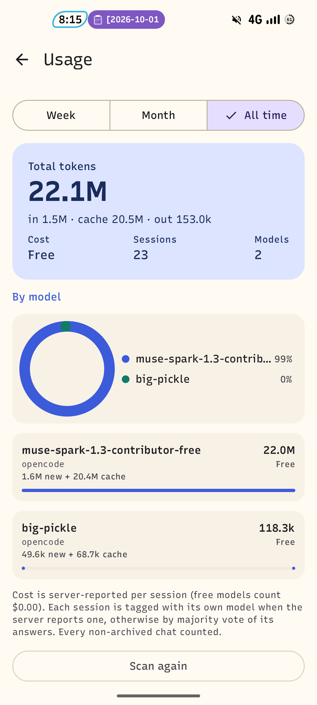

# Quark Code


**Run [opencode](https://github.com/anomalyco/opencode) on your phone. No laptop needed.**

Quark Code is a native Android chat client for the opencode AI coding agent. Use the on-device backend (Debian guest + official opencode server on loopback), or point it at your own server over LAN / Tailscale.

> ⚠️ **First public release (v0.14.0).** Works for daily use, but expect rough edges.
> v1 is not accepting pull requests — please [file issues](https://github.com/rgprince/Quark/issues) and ⭐ star so others can find it.

## Screenshots

| New chat | Agent at work | Chats drawer |
|---|---|---|
|  |  |  |

| On-device backend | Appearance | Usage + cost |
|---|---|---|
|  |  |  |

## What you get

- **Agent chat** — streaming replies, thinking indicator, tool / patch / image / error cards, permission prompts (Allow once / Always / Deny), todo list, per-turn timeline.
- **Chats drawer** — search + day-grouped history (Today / Yesterday / Previous 7–30 days). New Chat, Workspace files, Review changes live here.
- **Composer** — single button morphs mic → send → stop. `/` commands and `@` file mentions above the keyboard.
- **Models & cost** — 225+ providers via OpenCode Zen, your own API keys (Settings → Device → Providers). Saved model per chat, context meter + cost readout, Usage screen with per-model totals.
- **Workspace files** — browse `/workspace` + read-only Debian system, breadcrumbs, search, copy / move / delete, ZIP extract, text + image viewer. Import from phone via system picker, export via Share / Save to phone.
- **Sandboxed** — the agent only sees `/workspace` plus the guest system. A Sandbox status screen shows exactly what it can reach.
- **Your theme** — System / Void (dark) / Paper (light) / Dynamic (wallpaper, Android 12+) / AMOLED, Compact / Comfortable density, Small / Medium / Large text.

## Quick start

1. Install the APK from [Releases](https://github.com/rgprince/Quark/releases) (look for `app-fdroid-release.apk` inside the `quark-release-apk` artifact):
   ```bash
   adb install -r app-fdroid-release.apk
   ```
2. Open the app → Settings → **Device** → enable **On-device backend**.
   First run downloads Debian + official opencode (~200 MB download, ~2.1 GB on disk when unpacked) — use Wi-Fi and keep ~2.5 GB free.
3. Settings → Device → **Providers & API keys** → tap a provider → save key. Then back in chat, pick a model and type `/help`.
4. Own hardware instead? Settings → Device → Connection → enter `http://<your-server>:4096/` → **Test & save**. The app attaches to it on every launch.

## On-device vs remote

| | On-device | Remote (LAN / Tailscale) |
|---|---|---|
| Server | official opencode in Debian guest (proot, no root), `serve --port 4096` on `127.0.0.1` | same opencode API on your machine |
| Needs | ~2.5 GB free, Wi-Fi for first download | reachable URL + password |
| Agent sees | `/workspace` only + guest system | whatever that server exposes |
| Internet | still needed — model API calls go to your provider | still needed |

Model calls always need internet. The guest itself runs locally once downloaded.

## Requirements

| Item | Needed |
|---|---|
| Device | arm64 phone (no x86 emulator) |
| OS | Android 9+ (API 28+) |
| RAM | ~700 MB–1 GB while running (4 GB+ device recommended) |
| Storage | ~2.5 GB free for Debian guest + opencode + workspace |
| Network | Online — model providers + remote server |

## Permissions & privacy

No accounts, no tracking, no ads.

| Permission | Why |
|---|---|
| `INTERNET` + `ACCESS_NETWORK_STATE` | talk to model providers + your opencode server (including `127.0.0.1:4096` loopback). Cleartext HTTP is allowed only because the on-device server is plain HTTP on loopback. |
| `RECORD_AUDIO` | mic button → voice-to-text only. No recording kept, no TTS. |
| `POST_NOTIFICATIONS` + `FOREGROUND_SERVICE (dataSync)` | keeper service keeps the local backend alive + Stop action. |

- API keys stay in app-private DataStore on your phone. They are only sent to the provider you chose.
- Files leave the sandbox only when you tap Share / Save. Guest system files can never be shared out (workspace-only FileProvider).
- See [RUNTIME_NOTICES.md](RUNTIME_NOTICES.md) for guest licenses, and Settings → About → License in the app.

## Troubleshooting

- **Backend won't start / `Server process died`** — open Settings → Device, read the server log (Copy button). Most common: half-downloaded Debian → Repair, or old binary → Check for opencode update.
- **`Error: agent coder not found` or version `0.0.x`** — that's the retired Go binary, it has no `serve` mode. Device → Check for opencode update once (~60 MB) to get the pinned `v1.18.25` Node build.
- **Port `4096` busy (`EADDRINUSE`)** — Quark adopts whatever already answers on 4096 instead of crashing. If it's stale, stop the backend and start again.
- **Two installs at once fail (dpkg lock)** — installs are serialized, the second waits. Don't kill the app mid-install.
- **Empty chats drawer** — tap to reload. Archived chats are hidden by design.
- **Release APK is ~5 MB, Debian is ~2 GB** — normal. APK stays lean, the guest downloads on opt-in.

## Build it yourself

Needs JDK 17, Gradle 9.5.0, Android SDK 37, Python 3 (for the small proot fetch script, needs internet).

```bash
gradle :app:assembleFdroidRelease
# APK: app/build/outputs/apk/fdroid/release/app-fdroid-release.apk (~5 MB)
```

- `fdroid` is the distributed flavor. `gplay` builds from the same code (no proprietary deps in either).
- Release builds sign with the checked-in demo key (`keystore/dummy.jks`, `quarkdemo`) so CI updates install with `adb install -r`. **Swap in a real keystore before any Play release, and never change the key after F-Droid merge.**
- CI (`.github/workflows/build.yml`) builds `:app:assembleRelease` and uploads `quark-release-apk`.

## License

Quark Code is free software under **GNU General Public License v3.0**. See [LICENSE](LICENSE).

Runtime pieces (downloaded, not linked — run as separate processes):
- opencode + Bun — MIT
- PRoot — GPL-2.0, libtalloc/shmem — BSD/ISC
- Debian rootfs — mixed (Debian)
- Apache Commons Compress — Apache-2.0

Flow ideas studied from AndCode (MIT). All Quark code is rewritten — no AndCode source copied. Full notes in [RUNTIME_NOTICES.md](RUNTIME_NOTICES.md).
